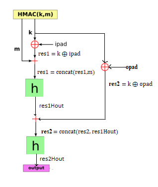

# CRC

## Функција: `obradi_unos`

### Параметри

- **unos**  
  Стринг који садржи низ бајтова за које је потребно наћи CRC. Сваки бајт се састоји од две цифре хексадецималног бројног система.  
  **Пример:**  
  `unos = 'ABCDEF125A'` се разлаже на бајтове `AB`, `CD`, `EF`, `12`, `5A`.

  Уколико је број хексадецималних цифара непаран, испред последње цифре у низу додаје се `0`, као неутралан елемент.
  
  **Пример:**
  `unos = 'ABCDEF125A4'` се разлаже на бајтове `AB`, `CD`, `EF`, `12`, `5A`, `04`.  

- **polinom**  
  Стринг који представља бинарну вредност CRC полинома.  
  **Пример:**  
  Полином \(X^8 + X^7 + X^2 + X^1 + X^0\) има бинарну репрезентацију: `polinom = '110000111'`.

- **significantByte**  
  Одређује да ли се ради над низом бајтова код којих је:  
  - **MSB (Most Significant Byte First)**  
    Бајт највеће тежине први у реду.  
    **Пример:**  
    Ако је `unos = 'ABCDEF125A'`, CRC ће се рачунати за бајтове редом:  
    1. `AB = 0000000001101010 = 0x6a`  
    2. `CD = 0000000110110110 = 0xb6`  
    3. `EF = 0000000100000010 = 0x2`  
    4. `12 = 0000000001010100 = 0x54`  
    5. `5A = 0000000100000100 = 0x4`  

  - **LSB (Least Significant Byte First)**  
    Бајт најмање тежине први у реду.  
    **Пример:**  
    Ако је `unos = 'ABCDEF125A'`, CRC ће се рачунати за бајтове редом:  
    1. `5A = 0000000100000100 = 0x4`  
    2. `12 = 0000000001010100 = 0x54`  
    3. `EF = 0000000100000010 = 0x2`  
    4. `CD = 0000000110110110 = 0xb6`  
    5. `AB = 0000000001101010 = 0x6a`  

- **endijan**  
  Одређује како су распоређени битови унутар сваког бајта.  
  - **Big Endian**  
    Бит највеће тежине је лево.  
     `AB → 10101011` 

  - **Little Endian**  
    Бит највеће тежине је десно.    
    `AB → 11010101` 

    За детаљније објашњење Big и Little Endian-а погледајте видео: [Endianness Explained](https://youtu.be/WBA6svOyWb8?si=VXCbw-e9bcdQS4wZ)
# HMAC

  
  
<em>Графички приказ рада HMAC алгоритма са хеш функцијом <strong>hash</strong></em>

## Функција: `hmac(key, message, opad, ipad)`

### Параметри
- **`key`**: Тајни кључ који се користи за генерисање HMAC.
  - Овај параметар се задаје као string који садржи хексадецималне цифре, а затим се претвара у низ битова и као такав се прослеђује функцији.  
    **Пример задавања кључа**: `key = bytes.fromhex("29AA")`

- **`message`**: Порука над којом се израчунава HMAC.
  - Овај параметар се задаје као string који садржи хексадецималне цифре које представљају поруку, а затим се претвара у низ битова и као такав се прослеђује функцији.  
    **Пример задавања поруке**: `message = bytes.fromhex("AA678823AABF12")`

- **`opad`**: Константа (outer padding) која се користи у алгоритму.
  - Овај параметар се задаје као чиста хексадецимална вредност.  
    **Пример задавања opad**: `opad = 0xA6`

- **`ipad`**: Константа (inner padding) која се користи у алгоритму.
  - Овај параметар се задаје као чиста хексадецимална вредност.  
    **Пример задавања ipad**: `ipad = 0x6A`

---

### Функција за одређивање хеш вредности: `hash(input_bytes)`
У зависности од примера или задатка који радите, потребно је прилагодити ову функцију.

💡 Напомена:
    Унутар функције `hmac`, потребно је изменити позиве `hash` функције како би се осигурало да се позива одговарајућа функција.
  
    
